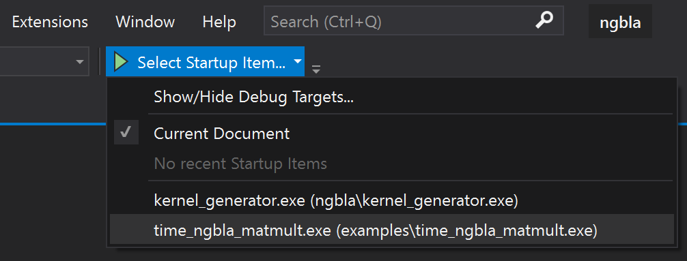

# NGBla

This repository provides the basic linear algebra module of NGSolve as standalone static library.


## Installation
### Windows
- Install [Visual Studio 2019 Community Edition] (https://visualstudio.microsoft.com/downloads/)
-  Start VS 2019 and select "Clone a repository"
- Set "Repository location" to https://github.com/NGSolve/ngbla and click "clone"
- Change the "Startup Item" to `time_ngbla_matmult.exe`

- Click the play button to run the example

### Linux/Mac
- Install [CMake](https://cmake.org) and [Git](https://git-scm.com/)
- Run in the terminal
```
git clone https://github.com/NGSolve/ngbla
cd nglba
mkdir build
cd build
cmake ..
make -j
./examples/time_ngbla_matmult.cpp
```

## Adding own examples
- Put `my_example.cpp` file in examples
- Add following lines to `examples/CMakeLists.txt`:
```
add_executable(my_example my_example.cpp)
target_link_libraries(my_example ngcore)
```

